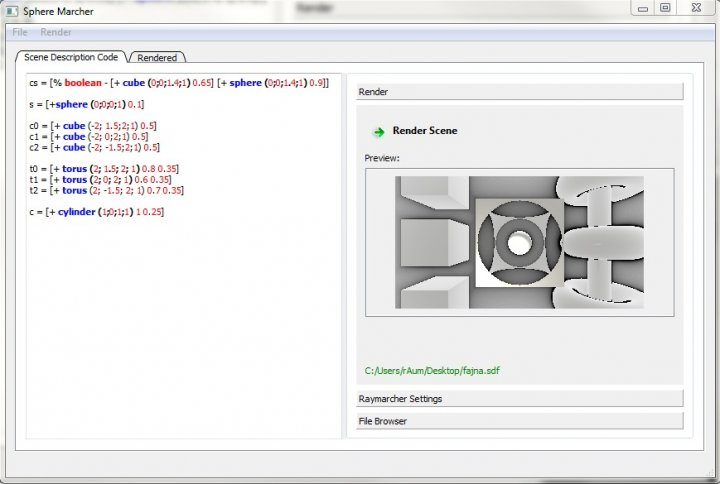
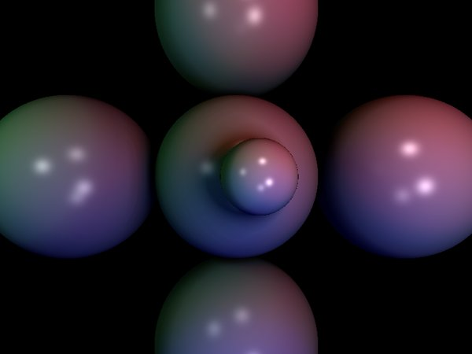

rum
===

simple software ray marcher. GUI made in Qt.

Scene format:

AddObject [Op + [Make Cube (5,4,3) (2,3,4)] [Op TransRot {1,0,0,0;0,1,0,0;0,0,0.5,1;0,0,0,1} [Make Sphere (2,3,4) 5] 6]
AddObject [Op - [Make Cube (5,4,3) (2,3,4)] [Make Sphere (2,3,4) 5]][%
AddLight  [(3,-6,-4) 10 (1,1,1)]
Set [Cam (5,4,3) (0,1,0)]

+ [+ a b] where a is for example: [! Sphere
+ [- a b]
+ [^ a b]

